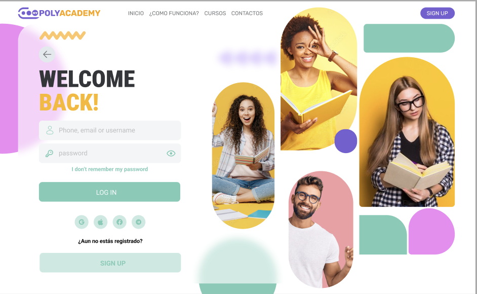

<h1 align="center">Hola! 👋, soy Lizeth Castillo — @liztechcode👩‍💻</h1>

  <strong>Desarrolladora web | Educadora Tech | Creadora de herramientas para aprender a programar</strong> 
  💡 Transformo ideas en productos digitales educativos 
  🧠 Ayudo a aprender programación con lógica, estructura y sin depender de tutoriales

---

- 🚀 +5 años de experiencia en el sector tecnologico : desarrollo web | Entrenamiento de bots.
- 🧠 Docente de programación: explico conceptos complejos con claridad y ejemplos reales.
- 📣 Comparto contenido sobre aprendizaje consciente, lógica de programación y uso estratégico de la IA.
- 🎮 Curiosa del desarrollo de juegos con JavaScript y Python.

---

## 🧰 Tech Stack

### 🧑‍🎨 Frontend

### 🔧 Backend

### 🗃️ Bases de Datos

### 🛠️ Herramientas

---

## 📊 GitHub Stats

| 📈 Estadísticas                                                                                                     | 🏆 Top Tecnologías                                                                                                   |
| ------------------------------------------------------------------------------------------------------------------ | ------------------------------------------------------------------------------------------------------------------- |
|  |  |

---

## 🌱 En proceso...

- ✨ **BrainLogic**: app educativa para aprender lógica de programación sin depender de tutoriales.
- 🎓 Cursos sobre fundamentos de programación y resolución de problemas.
- 🧩 Ejercicios diarios y proyectos para entrenar tu logica.

---
<h2 align="center">🚀 Proyectos Destacados</h2>

<table align="center" border="0" cellspacing="0" cellpadding="10" style="table-layout: fixed; width: 100%; max-width: 1200px;">
  <tr>
    <td align="center" valign="top" style="border: none; width: 25%;">
      <h3>🐍 Snake Game</h3>
      
      

        
Snake Game Extreme es una versión adrenalínica del clásico juego de la serpiente, llevado al siguiente nivel con enemigos dinámicos que aparecen, desaparecen y se mueven por el tablero.

      

    </td>
    <td align="center" valign="top" style="border: none; width: 25%;">
      <h3>🎓📚👩‍💻 Polymanager</h3>
      
      

        
Poly Manager Front es una plataforma de gestión educativa desarrollada con Nuxt 3, que permite la administración de cursos en línea con interfaces para estudiantes y profesores.

      

    </td>
    <td align="center" valign="top" style="border: none; width: 25%;">
      <h3>📋 Invoices App</h3>
      
      

        
Una aplicación web moderna para la gestión de facturas desarrollada con React y Vite. Esta aplicación permite a los usuarios gestionar, crear y dar seguimiento a sus facturas.

      

    </td>
    <td align="center" valign="top" style="border: none; width: 25%;">
      <h3>📞 Agenda Telefónica</h3>
      
      

        
Una aplicación web para gestionar contactos telefónicos desarrollada con React. Permite agregar, filtrar y eliminar contactos con una interfaz sencilla y funcional.

      

    </td>
  </tr>
  <tr>
    <td align="center" style="border: none;">
      <a href="https://github.com/lizethcas/snake_game">Ver Proyecto 🚀</a>
    </td>
    <td align="center" style="border: none;">
      <a href="https://github.com/lizethcas/poly_manager_front">Ver Proyecto 🚀</a>
    </td>
    <td align="center" style="border: none;">
      <a href="https://github.com/lizethcas/invoices-app">Ver Proyecto 🚀</a>
    </td>
    <td align="center" style="border: none;">
      <a href="https://github.com/lizethcas/phonebook">Ver Proyecto 🚀</a>
    </td>
  </tr>
</table>

---

## 📣 Conecta conmigo

---

_“💡 No quiero que memorices. Quiero que **entiendas**. Porque cuando entiendes, puedes crear sin miedo.”_

🌟 ¡Gracias por pasarte por aquí!  
💌 Si te interesa colaborar, aprender o testear BrainLogic, mándame un mensajito.

---

